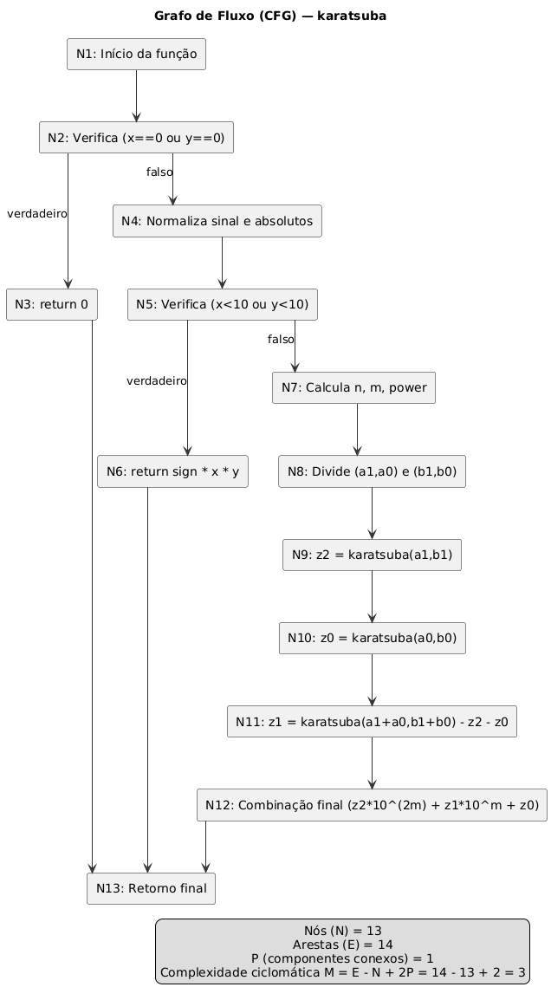

# Algoritmo de Karatsuba – Multiplicação de Inteiros em Python

**Disciplina:** Fundamentos de Projeto e Análise de Algoritmos  
**Autor:** *Amanda Bueno*  
**Linguagem:** Python

---

## Descrição do Projeto

O **algoritmo de Karatsuba** é uma técnica eficiente para multiplicar números inteiros grandes, proposta por Anatolii Karatsuba em 1960.  
Ele reduz o número de multiplicações necessárias de 4 para 3 em cada passo recursivo, melhorando a complexidade em relação à multiplicação tradicional.

### Lógica da Implementação

```python
def karatsuba(x: int, y: int) -> int:
    if x == 0 or y == 0:
        return 0
    sign = 1
    if x < 0:
        x, sign = -x, -sign
    if y < 0:
        y, sign = -y, -sign
    if x < 10 or y < 10:
        return sign * x * y
    n = max(len(str(x)), len(str(y)))
    m = n // 2
    power = 10 ** m
    a1, a0 = divmod(x, power)
    b1, b0 = divmod(y, power)
    z2 = karatsuba(a1, b1)
    z0 = karatsuba(a0, b0)
    z1 = karatsuba(a1 + a0, b1 + b0) - z2 - z0
    return sign * (z2 * 10 ** (2 * m) + z1 * power + z0)
````

* **Linhas 1-3:** Tratamento de caso trivial (se algum número é zero).
* **Linhas 4-9:** Ajuste do sinal e conversão para valores absolutos.
* **Linhas 10-12:** Caso base – se algum número for de um dígito, faz multiplicação direta.
* **Linhas 13-15:** Define o ponto de corte para dividir os números.
* **Linhas 16-17:** Divide os números em partes altas (a1, b1) e baixas (a0, b0).
* **Linhas 18-20:** Calcula os três produtos recursivos (z2, z0, z1).
* **Linha 21:** Recombina os resultados e retorna o valor final com o sinal correto.

---

## Como Executar o Projeto

### Requisitos

* Python 3.8+
* Nenhuma biblioteca externa necessária

### Execução

Clone o repositório e rode o script:

```bash
python3 main.py
```

Ao executar, o programa solicitará dois números inteiros como entrada:

```
Digite o primeiro número: 123456789
Digite o segundo número: 987654321
Resultado: 121932631112635269
```

---

## Relatório Técnico

### 1) Complexidade Ciclomática

O grafo de fluxo da função `karatsuba` pode ser representado assim:

- **Nós (𝑵):**

1. **N1:** Início da função.
2. **N2:** Verificação `x == 0 ou y == 0`.
3. **N3:** Retorno imediato `return 0`.
4. **N4:** Normalização de sinal e conversão para valores absolutos.
5. **N5:** Verificação de caso base `x < 10 ou y < 10`.
6. **N6:** Retorno do caso base `return sign * x * y`.
7. **N7:** Cálculo de `n`, `m` e `power = 10**m`.
8. **N8:** Divisão dos operandos: `(a1,a0)`, `(b1,b0)`.
9. **N9:** Cálculo recursivo `z2 = karatsuba(a1, b1)`.
10. **N10:** Cálculo recursivo `z0 = karatsuba(a0, b0)`.
11. **N11:** Cálculo `z1 = karatsuba(a1+a0, b1+b0) - z2 - z0`.
12. **N12:** Combinação do resultado `z2 * 10^(2m) + z1 * 10^m + z0`.
13. **N13:** Retorno final do resultado com sinal.

**Número total de nós:** 𝑵 = 13.

---

- **Arestas (𝑬):**

1. **N1 → N2:** Do início para a verificação de zero.
2. **N2 → N3:** Condição verdadeira (`x==0 ou y==0`) leva ao retorno imediato.
3. **N2 → N4:** Condição falsa segue o fluxo normal.
4. **N3 → N13:** Do retorno imediato para o nó de saída.
5. **N4 → N5:** Após normalização, verifica caso base.
6. **N5 → N6:** Caso base verdadeiro retorna multiplicação direta.
7. **N6 → N13:** Do retorno do caso base para o nó de saída.
8. **N5 → N7:** Caso base falso segue para cálculo de `n`, `m`, `power`.
9. **N7 → N8:** Da preparação numérica para a divisão dos operandos.
10. **N8 → N9:** Início das chamadas recursivas (parte alta).
11. **N9 → N10:** Próxima chamada recursiva (parte baixa).
12. **N10 → N11:** Chamada recursiva combinada e ajuste de `z1`.
13. **N11 → N12:** Combinação dos termos.
14. **N12 → N13:** Retorno final.

**Número total de arestas:** 𝑬 = 14.

---



---

### Complexidade ciclomática (𝑴)

* Nós (N) = 13
* Arestas (E) = 14
* Componentes conexos (P) = 1

_M = E - N + 2P = 14 - 13 + 2*1 = 3_

> Existem 3 caminhos independentes: (1) retorno por zero, (2) retorno por caso base de 1 dígito, (3) recursão completa.

---

### 2) Complexidade Assintótica

**Tempo (T(n))**
- A cada divisão, são feitas 3 chamadas recursivas sobre números de tamanho ~ n/2.
- Recorrência:
  T(n) = 3 * T(n/2) + O(n)
- Solução pela Regra Mestre:
  T(n) = Θ(n^log₂3)  ≈  Θ(n^1.585)
- Observação: para n >= 2 dígitos, melhor, médio e pior caso são iguais (as 3 chamadas sempre ocorrem).
- Exceção: se um operando tem 1 dígito, cai no caso base em O(1).

**Espaço (S(n))**
- Pilha de recursão: O(log n)
- Variáveis temporárias podem ter até O(n) dígitos
- Portanto: S(n) = O(n)

**Resumo**
- Melhor caso: O(1) (quando um número tem 1 dígito)  
- Caso médio: Θ(n^log₂3) ≈ Θ(n^1.585)
- Pior caso:  Θ(n^log₂3) ≈ Θ(n^1.585)

---

## Estrutura do Repositório

```
.
├── main.py       # Implementação do algoritmo
├── README.md     # Explicação e relatório técnico
└── images/       # Imagens utilizadas na documentação
```

---

## Referências

- Cormen, Leiserson, Rivest, Stein – *Introduction to Algorithms*  
- Karatsuba, A. – *Multiplication of Many-Digital Numbers by Automatic Computers* (1962)  
- Materiais das aulas da disciplina Fundamentos de Projeto e Análise de Algoritmos

---
